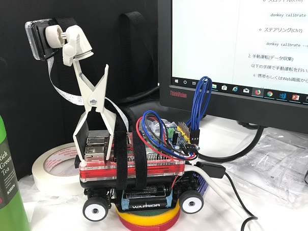

# Donkey Car 2号車 "Emperor号" 用アプリリポジトリ

WORRIORベースのDonkey Car独自アプリのディレクトリをリポジトリ化したものです。




## 部品リスト

### 車体

|品名|参考価格|用途|
|:-|-:|:-|
| [WARRIOR 4WD レーシングカーアセンブリシャーシ WR-41005](https://amzn.to/2TC1JNd) | \15,966 | 本体シャーシキットバッテリ、充電器、ESCつき |
| [RSコンポーネントRaspberry Pi 3 B +マザーボード](https://amzn.to/2R15nOH) | \5,000 | Donkey Carのコントローラ |
| [Raspberry Pi Camera Module V2 カメラモジュール](https://amzn.to/2QXEGui) | \3,800 | Wideアングルにしても良い。ケーブル付きだがZeroWにする場合は接続できない |
| [Pibow 3 B+ Coupe パイボー クーペ for Raspberry Pi 3B+/3/2 (01 レッド Red) ](https://amzn.to/2R3IbQ7) | \2500 | Raspberry Piケース |
｜[HiLetgo PCA9685 16チャンネル 12-ビット PWM Servo モーター ドライバー IIC モジュール](https://amzn.to/2S9CPmt) | \550 | Servoドライバ |
| [三脚マウントナット付きPiカメラケース](https://www.switch-science.com/catalog/3131/) | \410 | PCA9685に組み付け |
| [プラネックス PLANEX CLIP-STAND カメラ用 クリップ式スタンド](https://www.yodobashi.com/product/100000001002619992/) | \672 | カメラケースと本体との組付けに使用 |
| [M2.6スペーサセット（スペーサ4個、ネジ8個）](https://www.switch-science.com/catalog/2268/) | \200 | PCA |
| [ジャンパワイヤ(オス～メス) 10本セット](https://amzn.to/2PO7EAf) | \492 | サーボからPCA9685までの延長に使用 |
| [ジャンパワイヤ(メス～メス) 10本セット](https://amzn.to/2zmhG1d) | \492 | PCA9685からRaspberry Piへつなぐ |
| [Anker PowerCore II 6700](https://amzn.to/2TyUtBq) | \2,599 | Raspberry Pi用バッテリ |
| [Micro USBケーブル 15cm 2本](https://amzn.to/2R3jgMu) | \998 | Raspberry PiとAnkerバッテリを結線 |
| [weksi マジックバンド結束テープ 10mm*4m 5色　5枚セット](https://amzn.to/2TBff3g) | \1,220 | シャーシにRaspberry Piとバッテリを組み付ける、着脱自由 |
| [ニトムズ はがせる両面テープ 強力接着用 15mm×10m T3830](https://amzn.to/2R32Kft) | \337 | Raspberry PiケースとAnkerバッテリを貼り付け |
| [サンディスク SANDISKSDSDQ-016G-J35U microSDHCカード 16GB Class4 変換アダプタ付き](https://www.yodobashi.com/product/100000001002349155/) | \1,060 | Raspberry PiのOS用 |

参考価格合計は \36,960。

* マイナスドライバ
* はさみ

### ジョイスティック

学習用データ収集のために使用するジョイスティック。以下のUSBドングルつきジョイスティックは、ドングルをつけるだけで/dev/input/js0として認識してくれた。

|品名|参考価格|備考|
|:-|-:|:-|
| [Logicool F710 Wireless Gamepad](https://www.yodobashi.com/product/100000001001732200/) | \2,910 | USBドングルつき、意外と重い |
| [エレコム ワイヤレス ゲームパッド 小型軽量 12ボタン ブラック JC-U3912TBK](https://amzn.to/2zlNza8) | \1,894 | USBドングルつき、軽め |

上記のジョイスティックはどちらも必要となる。

* 単3電池×2

ジョイスティックの代わりに、スマートフォンでも操作可能。

### 参考ドキュメント

以下の日本語リンクを参考にしてください。

* [Raspberry Pi/donkeycar セットアップ](https://github.com/coolerking/donkeycar_jpdocs/blob/master/donkeycar/docs/guide/install_software.md)
* [donkeypart_ps3_controller セットアップ](https://github.com/coolerking/donkeycar_jpdocs/tree/master/donkeypart_ps3_controller)
* [結線図参考](https://www.slideshare.net/HoriTasuku/donkey-car)


## インストール

1. emperor 上のRaspberry Piにターミナル接続します。

2. 以下のコマンドを実行して、python donkeycar パッケージのバージョンが2.5.8であることを確認します。
   ```bash
   python -c "import donkeycar as dk; print(dk.__version__)"
   ```

3. 以下のコマンドを実行して、リポジトリをRaspberry Pi上に展開します。
   ```bash
   git clone https://github.com/coolerking/emperor.git
   ```

### Logicool F710 ジョイスティックを使用する

1. Raspberry Piをシャットダウン
2. Logicool F710コントローラ同梱のUSBドングルをRaspberry Piにセット
3. Raspberry Piを起動
4. ターミナル接続し、ログイン
5. F710本体正面のLogicoolボタンを押す（電源ON）
6. 以下のコマンドを実行し、F710が接続されていることを確認する
   ```bash
   ls /dev/input/js0
   hexdump /dev/input/js0
   ```
   hexdumpを実行後、F710を適当に操作すると、ヘキサダンプが表示されれば、正常。Ctrl+Cで終了する。
7. `~/mycar/manage.py` を次のように編集する
   ```python
        # F710用ジョイスティックコントローラを使用
        from parts.logicool import F710_JoystickController
        ctr = F710_JoystickController(
        # PS4 Dualshock4 ジョイスティックコントローラを使用
        #from donkeypart_ps3_controller.part import PS4JoystickController
        #ctr = PS4JoystickController(
        # ELECOM JC-U3912T ジョイスティックコントローラを使用
        #from parts.elecom import JC_U3912T_JoystickController
        #ctr = JC_U3912T_JoystickController(
   ```

### ELECOM JC-U3917T ジョイスティックを使用する

1. Raspberry Piをシャットダウン
2. ELECOM JC-U3912T コントローラ同梱のUSBドングルをRaspberry Piにセット
3. Raspberry Piを起動
4. ターミナル接続し、ログイン
5. JC-U3912T本体下部の電源スイッチを入れ、本体のボタンを適当に数回操作する
6. 以下のコマンドを実行し、F710が接続されていることを確認する
   ```bash
   ls /dev/input/js0
   hexdump /dev/input/js0
   ```
   hexdumpを実行後、F710を適当に操作すると、ヘキサダンプが表示されれば、正常。Ctrl+Cで終了する。
7. `~/mycar/manage.py` を次のように編集する
   ```python
        # F710用ジョイスティックコントローラを使用
        from parts.logicool import F710_JoystickController
        ctr = F710_JoystickController(
        # PS4 Dualshock4 ジョイスティックコントローラを使用
        #from donkeypart_ps3_controller.part import PS4JoystickController
        #ctr = PS4JoystickController(
        # ELECOM JC-U3912T ジョイスティックコントローラを使用
        #from parts.elecom import JC_U3912T_JoystickController
        #ctr = JC_U3912T_JoystickController(
   ```
8. ジョイスティック上のボタン割り当てを変更する場合は、`parts\elecom.py` の以下のコードを編集する。
   ```python
        self.button_down_trigger_map = {
            '11': self.toggle_mode,                # 運転モード変更(user, local_angle, local)
            '4': self.toggle_manual_recording,     # tubデータ保管
            '2': self.erase_last_N_records,        # 最後のN件tubデータ削除(未実装?)
            '3': self.emergency_stop,              # 緊急ストップ
            '7': self.increase_max_throttle,       # 最大スロットル値＋＋
            '8': self.decrease_max_throttle,       # 最大スロットル値ーー
            '12': self.toggle_constant_throttle,   # 常時一定スロットル確保
            "6": self.chaos_monkey_on_right,       # カオスモード
            "5": self.chaos_monkey_on_left,        # カオスモード
        }

        self.button_up_trigger_map = {
            "6": self.chaos_monkey_off,            # カオスモードoff
            "5": self.chaos_monkey_off,            # カオスモードoff
        }

        self.axis_trigger_map = {
            'left_stick_horz': self.set_steering,  # ステアリング操作
            'right_stick_vert': self.set_throttle, # スロットル操作
        }
   ```


### SONY Dualshock4 PS4 ジョイスティックを使用する

donkeypart_ps3_controller パッケージと [別売りUSBドングル](https://amzn.to/2QYbVhe) を使って接続します。

1. Raspberry Piをシャットダウン
2. Dualshock4 USBドングル( [別売](https://amzn.to/2QYbVhe) )をRaspberry Piにセット
3. Raspberry Piを起動
4. ターミナル接続し、ログイン
5. Dualshock4 USBドングルを刺した方向に３秒以上押し込み、青LEDの点滅を早くする
5. Dualshock4のSHAREボタンとPSロゴボタンを同時に3秒以上押す
   ドングルのLEDが青点灯状態になると成功。
6. 以下のコマンドを実行し、Dualshock4コントローラが接続されていることを確認する
   ```bash
   ls /dev/input/js0
   hexdump /dev/input/js0
   ```
   hexdumpを実行後、Dualshock4コントローラを適当に操作すると、ヘキサダンプが表示されれば、正常。Ctrl+Cで終了する。
7. `~/mycar/manage.py` を次のように編集する
   ```python
        # F710用ジョイスティックコントローラを使用
        #from parts.logicool import F710_JoystickController
        #ctr = F710_JoystickController(
        # PS4 Dualshock4 ジョイスティックコントローラを使用
        from donkeypart_ps3_controller.part import PS4JoystickController
        ctr = PS4JoystickController(
        # ELECOM JC-U3912T ジョイスティックコントローラを使用
        #from parts.elecom import JC_U3912T_JoystickController
        #ctr = JC_U3912T_JoystickController(
   ```
8. ジョイスティック上のボタン割り当てを変更する場合は、`parts\logicool.py` の以下のコードを編集する。
   ```python
        self.button_down_trigger_map = {
            'RB': self.toggle_mode,                     # 運転モード変更(user, local_angle, local)
            'LB': self.toggle_manual_recording,         # 手動記録設定変更
            'Y': self.erase_last_N_records,             # 最後のN件を削除(動作していない?)
            'A': self.emergency_stop,                   # 緊急ストップ
            'LB': self.toggle_constant_throttle,        # 一定速度維持
            'LT_pressure': self.chaos_monkey_on_left,   # カオスモード左
            'RT_pressure': self.chaos_monkey_on_right,  # カオスモード右
            'X': self.increase_max_throttle,            # 最大スロットル＋＋
            'B': self.decrease_max_throttle,            # 最大スロットル－－
        }

        self.button_up_trigger_map = {
            "LT_pressure": self.chaos_monkey_off,       # カオスモードオフ
            "RT_pressure": self.chaos_monkey_off,       # カオスモードオフ
        }

        self.axis_trigger_map = {
            'left_stick_horz': self.set_steering,       # ステアリング操作
            'right_stick_vert': self.set_throttle,      # スロットル操作

        }
   ```


## 実行

1. キャリブレーション

   スロットル、ステアリングの調整を以下のコマンドで行い、取得した値を `config.py` に書き込みます。


   * スロットル(Ch0)
     本車体はシャーシに対して重量があるため、やや速度早めに設定しておくことをすすめます。
     ```bash
     donkey calibrate --channel 0
     ```

   * ステアリング(Ch1)
     本車体は、自重のせいでシャコタン状態であるため、最大舵角をとると車輪が浮くので、それほど最大舵角をとることができません。
     ```bash
     donkey calibrate --channel 1
     ```

2. 手動運転(データ収集)

   以下の手順で手動運転を行い、学習データ(tubデータ)を `data` ディレクトリに収集します。

   * 携帯もしくはWeb画面から操作
      ```bash
      cd emperor
      python manage.py drive
      ```

   * ジョイスティックから操作
      ```bash
      cd emperor
      python manage.py drive --js
      ```

3. トレーニング

   トレーニングは Raspberry Pi上ではなく、PC等で実行します。
   `emperor/data` ディレクトリをトレーニングを実行するノードへコピーし、`python manage.py --tub <tubデータディレクトリ> --model models/mypylot` を実行します。

   > トレーニングを実行するノードのdonkeycar パッケージのバージョンも 2.5.8 を使用してください。

   上記コマンドを実行すると、`mypilot`が新たに作成されるので、これを Raspberry Pi 側の `emperor/models` ディレクトリにコピーします。

4. 自動運転

   以下の手順で自動運転を実行します。
   ```bash
   git clone https://github.com/autorope/donkeypart_ps3_controller.git
   cd donkeypart_ps3_controller
   pip install -e .
   cd ..
   cd emperor
   python manage.py drive --model models/mypilot
   ```


## 利用OSS

* GitHub [autorope/donkeycar](https://github.com/autorope/donkeycar) v2.5.8
  Donkey Car の基本機能OSS、MITライセンス準拠です。2.5.1から2.5.8へ更新した際にpartsのリポジトリは分割されました。

* GitHub [autorope/donkeypart_ps3_controller](https://github.com/autorope/donkeypart_ps3_controller)
  PS3やPS4を使用しない場合でもF710やJC-U3912Tの各コントローラが基底クラスとして使用しています。

## ライセンス

本リポジトリの上記OSSで生成、コピーしたコード以外のすべてのコードはMITライセンス準拠とします。
