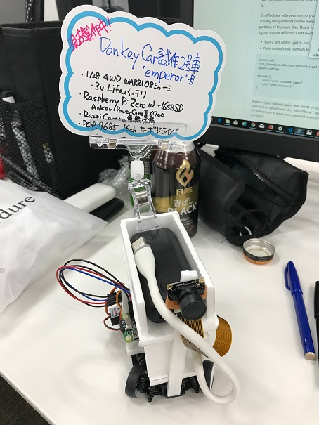

# emperor

WORRIORベースのDonkey Car独自アプリのディレクトリをリポジトリ化したものです。



## インストール

1. emperor 上のRaspberry Piにターミナル接続します。

2. 以下のコマンドを実行して、python donkeycar パッケージのバージョンが2.5.8であることを確認します。
   ```bash
   python -c "import donkeycar as dk; print(dk.__version__)"
   ```

3. 以下のコマンドを実行して、リポジトリをRaspberry Pi上に展開します。
   ```bash
   git clone https://github.com/coolerking/emperor.git
   ```

### F710ジョイスティックを使用する

TBD

## 実行

1. キャリブレーション

   スロットル、ステアリングの調整を以下のコマンドで行い、取得した値を `config.py` に書き込みます。


   * スロットル(Ch0)
     ```bash
     donkey calibrate --channel 0
     ```

   * ステアリング(Ch1)
     ```bash
     donkey calibrate --channel 1
     ```

2. 手動運転(データ収集)

   以下の手順で手動運転を行い、学習データ(tubデータ)を `data` ディレクトリに収集します。

   * 携帯もしくはWeb画面から操作
      ```bash
      cd emperor
      python manage.py drive
      ```

   * ジョイスティックから操作
      ```bash
      cd emperor
      python manage.py drive --js
      ```

3. トレーニング

   トレーニングは Raspberry Pi上ではなく、PC等で実行します。
   `emperor/data` ディレクトリをトレーニングを実行するノードへコピーし、`python manage.py --tub <tubデータディレクトリ> --model models/mypylot` を実行します。

   > トレーニングを実行するノードのdonkeycar パッケージのバージョンも 2.5.8 を使用してください。

   上記コマンドを実行すると、`mypilot`が新たに作成されるので、これを Raspberry Pi 側の `emperor/models` ディレクトリにコピーします。

4. 自動運転

   以下の手順で自動運転を実行します。
   ```bash
   cd emperor
   python manage.py drive --model models/mypilot
   ```

## 利用OSS

* GitHub [autorope/donkeycar](https://github.com/autorope/donkeycar) v2.5.8
  Donkey Car の基本機能OSS、MITライセンス準拠です。2.5.1から2.5.8へ更新した際にpartsのリポジトリは分割されました。

* GitHub [mituhiromatuura/donkey](https://github.com/mituhiromatuura/donkey)
  GitHub上にてMITライセンス準拠で公開されている GitHub mituhiromatuura/donkey リポジトリのparts/controller_logicool.py を利用しています。

## ライセンス

本リポジトリの上記OSSで生成、コピーしたコード以外のすべてのコードはMITライセンス準拠とします。
